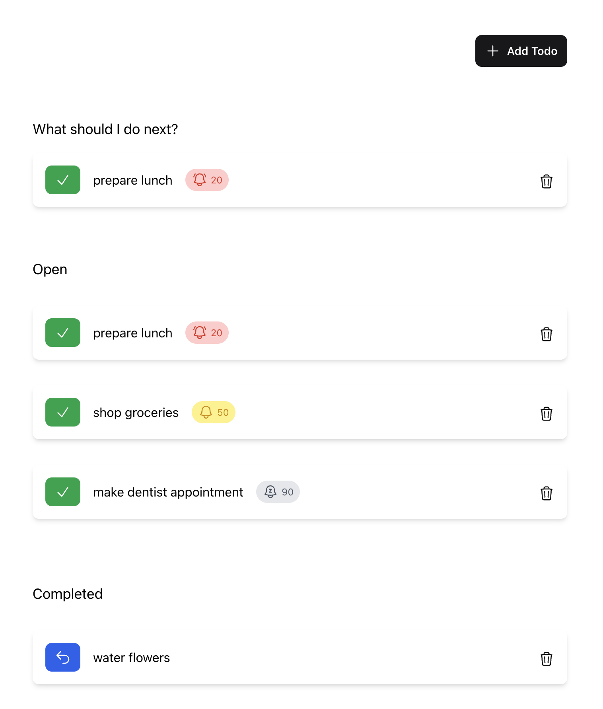
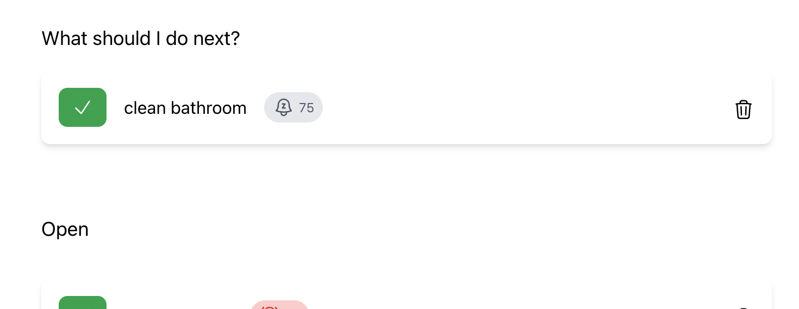

# Assignment - Todo Recommendations

A small Elixir/Phoenix assignment for the [Choosy](https://choosy.de) hiring process.

---

Hey there 👋, we are Choosy, a young tech startup from Germany.
We're on a mission to make healthy, sustainable eating effortless. And we're convinced that with state-of-the-art technology and a talented team, we will solve this crucial challenge.

Have you found this repository by random chance?
Are you interested in working as an Elixir developer on something relevant,
and love to tackle exciting challenges?

Head over to our [job board](https://choosy.de/jobs) or contact us directly at [jobs@choosy.de](mailto:jobs@choosy.de?subject=Elixir%20Developer).

---

This repository contains a very simple Phoenix application,
that uses an SQLite3 database for persistence.

The application manages a list of Todos.
Todos can be created, marked as done and finally removed from the list.
All todos have a priority that represent the urgency of a todo.

Whenever the user opens the list of Todos,
the system tries to recommend a todo,
that should be performed next by the user.
However, the logic which selects the recommended todo is not very smart (yet).
It will be your task to improve the todo recommendation logic during this assignment.

## Getting started

> We recommend to fork this repository to your GitHub account before you get started,
> which makes it much easier to hand in the solution when you are done.

Ensure you have Elixir 1.14 and Erlang/OTP 25 installed.
We recommend using [asdf](https://asdf-vm.com/),
in which case you can use the `.tool-versions` file in this repository,
to setup your development environment.

Once your enviroment is prepared, run `mix setup` from the root directory of this repository,
to compile the project and initialize the development database.

Finally start the Phoenix server with `mix phx.server` or inside IEx with `iex -S mix phx.server`.

Now you can visit [`http://localhost:4000`](http://localhost:4000) from your browser and interact with the application.

> **Note**
> There is nothing special about this application,
> so if you get stuck you can always have a look at the [official Phoenix docs](https://hexdocs.pm/phoenix/1.7.1/installation.html).

## Assignment

The assignment consists of two exercises, that are functionally related,
but don't build upon each other.
For both exercies you have to clone this repository,
get the application running locally and then work on the code,
as you would with any other Elixir/Phoenix application.

### What is and isn't expected

- We don't expect you to complete all exercises.
The main goal of the assignment is to have some code we can talk about in our next call.
We don't want to use more of your free time than absolutely necessary.
The assignment is intended to take **up to 4 hours**, but not more.

- It is up to you which exercise you start with.
There is no need to do exercise 1 first.

- The application should work out of the box.
No show-stopper kind of programming errors have been intentionally added to it.
However, we expect you to **fix any existing application/logic errors** that you may find.
We would love to discuss them in our next call.

- We expect you to do **local refactorings and small code improvements** as you see fit.
However, do not focus on the HTML/CSS/JS part of the application, unless absolutely necessary.
This is an Elixir assignment after all.

- Last but not least we expect you to **use Git** during the assignment.
Put your changes into appropriately sized commits,
just as if you were working in a collaborative environment.

### Exercise 1: Improve the quality of 'What should I do next?' recommendations

When opening [`http://localhost:4000/todos`](http://localhost:4000/todos),
the system displays one of the todos at the top,
that it recommends to be performed next.
Currently this todo is selected randomly from the list of open todos.

We would like to continue displaying a randomly selected todo in this spot,
but the todo should be selected in such a way,
that todos with a higher urgency also have a higher chance to be recommended.

The probability of a todo to be recommended should correspond to its urgency,
when compared to the urgency of other todos.

As an example lets consider there are 4 open todos in the list:

- *Prepare lunch* (priority: `20`)
- *Water flowers* (priority: `50`)
- *Shop groceries* (priority: `60`)
- *Buy new flower pots* (priority: `130`)

> **Note**
> A high urgency is encoded as a lower value in the `priority` field of a todo.
> For example a todo with a `priority` of `20` is considered to be more urgent than a todo with a `priority` of `50`.

The probability for recommending *Prepare lunch* should be `~2.5` times as high as recommending *Water flowers*, `~3` times as high as *Shop groceries* and `~6.5` times as high as recommending *Buy new flower pots*.
All other probabilities should follow the same rule.

### Exercise 2: Persist the 'What should I do next?' recommendation

Currently the recommended todo changes whenever the page is refreshed.
From a user perspective this behavior is far from being ideal.
We want to "generate" a recommended todo and then keep it for some time,
so it doesn't change when the page is reloaded or the browser window is closed and reopened later.
However, when the todo is marked done, a new recommendation must be generated if there are any open todos left.

It is up to you how to persist this information.
You can use the SQLite database, but you don't have to.
We don't expect the recommendation to be persisted across server restarts.

## Handing in the solution

- If you have forked this repository, ensure you pushed all your changes and then send
a link to your forked repository to [jobs@choosy.de](mailto:jobs@choosy.de?subject=Choosy%20Elixir%20Assignment). Also make sure the repository is publicy accessible.

- Alternatively you can send your solution directly by mail to [jobs@choosy.de](mailto:jobs@choosy.de?subject=Choosy%20Elixir%20Assignment),
for example as a zip archive.
Please make sure the solution contains the entire project including the `.git` directory,
so we can have a look at your commits.